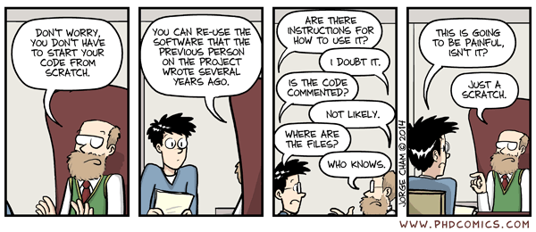
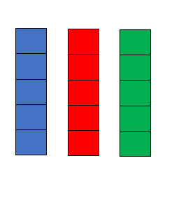
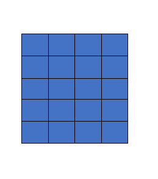
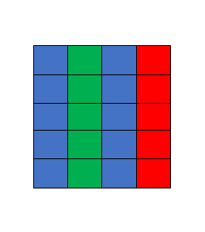
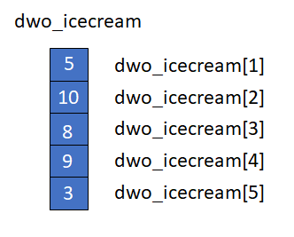
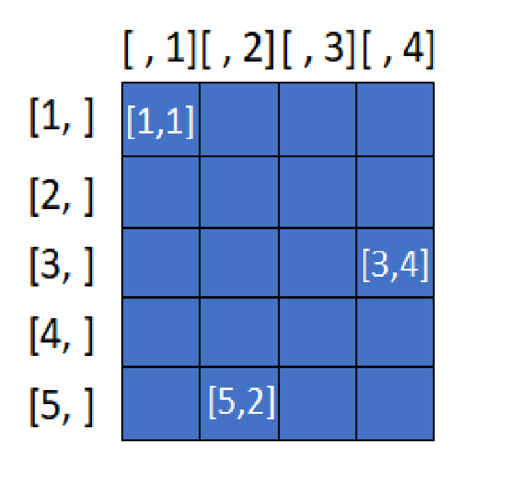
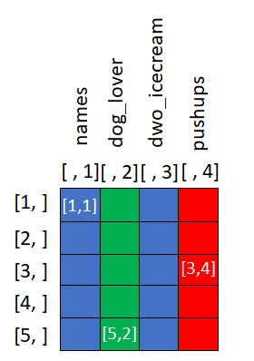
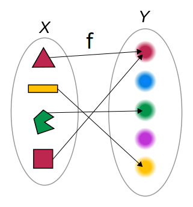

```{r setup, include=FALSE}
knitr::opts_chunk$set(echo = TRUE, message = FALSE, warning = FALSE)
```

# First steps

## R
- It is an object-oriented language;
- Objects are boxes that we can use to store different classes of content;
- Objects need names. Names should always start with letters and it also can contain numbers, but only a few special characters: underscore or period;
- In order to store, we use the assignment operator <span style="color: blue;"><-</span> or <span style="color: blue;">=</span>.

- Objects can be classified in three classes of content: numeric, character, logical;
    - Numeric objects contain numbers such that they can be double (dbl) or integers (int);
    - Character (chr) objects contain strings, i.e., text between quotes;
        - If a character object contains only a pre-defined set of values, then it is considered a factor (fct).
    - Logical objects (lgl) contain logical statements, i.e., <span style="color: blue;">TRUE</span> or <span style="color: blue;">FALSE</span>.


## Let's code our first objects:
```{r}
# Who is it?
dwo_icecream <- 11 # days without icecream
favorite_food <- "risotto"
dog.lover = TRUE
enjoy_cold <- FALSE
```

- Objects are listed in the \textbf{Environment} tab;
- Comments are preceded with <span style="color: blue;">\#</span>.

- Objects can be accessed based on their names;
```{r}
dwo_icecream
favorite_food
enjoy_cold
```


## Good practices for coding in R
- It suggests to avoid <span style="color: blue;">.</span> on names of objects and <span style="color: blue;">=</span> as assignment operator;
```{r}
dog_lover <- dog.lover
rm(dog.lover)
dog_lover
```
- The **function** <span style="color: blue;">rm</span> removes objects from the Environment tab.

### Comment your code

{height=70%}


{width=70%}

## Vectors

{width=50%}

- We can combine objects using the **function** <span style="color: blue;">c</span>;
- We calculate the length of a vector using the function **function** <span style="color: blue;">length</span>.

- Let's do it in R:
```{r}
dwo_icecream <- c(5, 10, 8, 9, 3) # days without ice-cream
dwo_icecream
length(dwo_icecream)
```

- All previous objects are also vectors, but with length 1:
```{r}
length(favorite_food)
```

- If we concatenate different types of vectors, they will be converted following the hierarchy: character > numeric > logical;
```{r}
# coerced all objects as characters
c(favorite_food, dog_lover, enjoy_cold, dwo_icecream) 
c(dog_lover, dwo_icecream)  # TRUE is converted into 1
c(enjoy_cold, dwo_icecream)  # FALSE is converted into 0
```

- Class of objects can be checked using the \textbf{function} <span style="color: blue;">class</span>. For vectors,
```{r}
class(dwo_icecream)
class(dog_lover)
class(favorite_food)
```

- Some numeric vectors can also be created with easier approaches than use the **function** <span style="color: blue;">c</span>:
```{r}
x <- c(1, 1, 1, 1, 1)
x
y <- rep(1, 5)
y
z <- c(1, 2, 3, 4, 5)
w <- 1:5
```

### Factors
- Factors are special vectors that assume only pre-defined values defined using **function** <span style="color: blue;">factor</span>:
```{r}
dog_lover <- c("yes", "no", "yes", "yes", "yes")
dog_lover <- factor(dog_lover, levels = c("no", "yes"))
dog_lover
```

```{r}
dog_lover <- c(1, 0, 1, 1, 1)
dog_lover <- factor(dog_lover, 
                    levels = c(0, 1), 
                    labels = c("no", "yes"))
dog_lover
```

```{r}
dog_lover <- c("yes", "no", "yes", "yes", "yes")
dog_lover <- as.factor(dog_lover)
dog_lover
```

- Factors have ordered levels:
```{r}
dog_lover
levels(dog_lover)
nlevels(dog_lover)
```


## Matrices
- Vectors can be bounded into two-dimensional arrays using the \textbf{function} <span style="color: blue;">cbind</span>:
```{r}
pushups <- c(1, 10, 0, 30, 25)
m <- cbind(dwo_icecream, pushups)
m
```


{width=50%}

- The class of two-dimensional arrays generated by cbind is matrix:
```{r}
class(m)
```


- When we bind vectors of different classes:
```{r}
names <- c("m", "n", "p", "b", "t")
m <- cbind(names, dog_lover, dwo_icecream, pushups)
m
```
- Matrices are not appropriate to store a dataset if we have different classes of vectors.

## Data frames
{width=50%}

- Data frames are created with the \textbf{function} <span style="color: blue;">data.frame</span>:
```{r}
df <- data.frame(names, dog_lover, 
                 dwo_icecream, pushups)
df
class(df)
```

# Subsetting

## Vectors
{width=50%}

- Components of a vector can be accessed using the operator <span style="color: blue;">[position]</span>:
```{r}
dwo_icecream
dwo_icecream[1]
dwo_icecream[c(1, 5)]
```

## Matrices
{width=50%}

- Components of a matrix can be accessed using the operator <span style="color: blue;">[position row, position column]</span>:
```{r}
m
```

- Components of a matrix can be accessed using the operator <span style="color: blue;">[position row, position column]</span>:
```{r}
m[1, 1]
```


- Row and columns of a matrix can be accessed using the operator <span style="color: blue;">[position row, ]</span> and
<span style="color: blue;">[, position column]</span>, respectively:
```{r}
m[5, ]
m[, 4]
```

## Data frames

{width=50%}

- Components of a data frame can be accessed similar to a matrix;
- In addition, columns can be accessed be their names using the operator <span style="color: blue;">\$</span>:
```{r}
# Subsetting columns
df$names
df$dog_lover

```

- Components of a data frame can be accessed similar to a matrix;
- In addition, columns can be accessed be their names using the operator <span style="color: blue;">\$</span>:
```{r}
# Subsetting a position in a column
df$names[5]
```


# Logical statements

## Object classes
- Logical statements about object's class can be done as follow:
```{r}
is.numeric(dwo_icecream)
is.logical(dwo_icecream)
is.character(dwo_icecream)
is.factor(dog_lover)
```

## Conditions
- Checking conditions can be done with logical statements:
  - Are these objects equal? 
```{r}
dog_lover == "yes"
```
  - Are these objects different?
```{r}
dog_lover != "yes"
```

- Checking conditions can be done with logical statements:
  - Is this object greater (less) than 35?
```{r}
dwo_icecream > 7 # for less, use <
```
  - Is this object greater (less) or equal than 35?
```{r}
dwo_icecream >= 7 # for less or equal, use <=
```

## Combining Conditions
- Conditions can combined:
  - AND
```{r}
dwo_icecream > 7 & dog_lover == "yes" # for less, use <
```
  - OR
```{r}
dwo_icecream > 7 | dog_lover == "no" # for less or equal, use <=
```

# Functions

## What is a function?

{width=50%}

- A function takes inputs, make operations and gives back outputs;
- Functions in R are organized in libraries;
- Every function has a documentation that can be accessed with the operator 
<span style="color: blue;">?</span>.

## First, let's access the documentation of some of them
```{r}
?length
?c
```
- Look at the tab **Help** to mode details of the function, including examples.

## Let's create our own function to convert Fahrenheit to Celsius.
```{r}
# minimum temperature
temp_f <- 38
temp_c <- (temp_f - 32)*(5/9)
temp_c

# range of temperatures
temp_f <- c(38, 105)
temp_c <- (temp_f - 32)*(5/9)
temp_c
```

## Let's create our own function
```{r}
temp_f_c <- function(temp_f){
  temp_c <- (temp_f - 32)*(5/9)
  return(temp_c)
}

temp_f_c(70)
temp_f_c(15)

```

# For loops

## How can we repeat tasks or perform them sequentially?
```{r}
i <- 1
i
i <- i + 1
i
i <- i + 1
i
```

## Control flow for iteration
```{r}
for (i in 1:3){
  print(i)
}
```

Control flow can be used as indexes of vectors and matrices
```{r}
x <- rep(NA, 3)

for (i in 1:3){
  x[i] <- i
}
x
```
